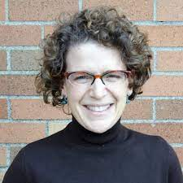
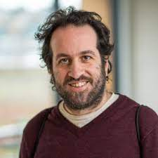
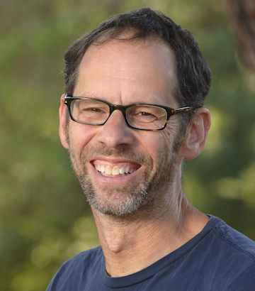

# What do we teach in NLP courses?

When we design NLP courses in different contexts, many of us struggle with at least some of the following points.   

- What models, tasks, applications should we include or exclude from the course? For example: 
    - Should we teach hidden Markov models or automatic speech recognition in an introductory NLP course? 
    - Is it OK to skip semantic parsing from an introductory NLP course? 
    - Should we skip details of LSTMs and focus more on transformer-based architectures? 
- How do we balance theory vs practice? How much detail is appropriate in the given context? For example, 
    - Do we go into the details of Gibbs sampling when teaching Latent Dirichlet Allocation for topic modeling? 
    - Is it more useful to spend more time on different practical aspects such as hyperparameters of the model or evaluation and interpretation of the topics given by the model?
    - How much time should we spend on teaching LSTMs vs showing how to implement them for different tasks using tools such as `PyTorch` or `TensorFlow`? 
    
**We would like to address your questions in the panel. Please write your questions on this topic in this [Google document](https://docs.google.com/document/d/1ZS8BhrAJHGa-RB5e8IHqSGsR6GAEpEXv552u9kZG1g0/edit?usp=sharing).**   
    
## Panelists
|               |                               |
| :--------------------------------------- | :-----------------   | 
|  | [**Isabelle Augenstein**](https://isabelleaugenstein.github.io/) is an associate professor in Computer Science at the University of Copenhagen. Her main research interests are fact checking, low-resource learning and explainability. She has developed and taught NLP courses at University of Copenhagen and University College London. She has also given tutorial and talks at a number of summer schools. | 
| | [**Emily M. Bender**](https://faculty.washington.edu/ebender/index.html) is a Professor of Linguistics and an Adjunct Professor in Computer Science and Engineering at the University of Washington. She is the Director of the [Computational Linguistics Master's program](https://www.compling.uw.edu/). She has a wealth of teaching and mentoring experience, and has taught many courses and seminars in Linguistics, Computational Linguistics, and Ethics in NLP in the past two decades.|
| | [**Yoav Goldberg**](https://www.cs.bgu.ac.il/~yoavg/uni/) is a Senior Lecturer in Computer Science at Bar Ilan University. He has taught a number of courses and seminars related NLP. He is the author of the famous tutorial on deep learning NLP, [A Primer on Neural Network Models for Natural Language Processing](https://u.cs.biu.ac.il/~yogo/nnlp.pdf), which has made deep learning NLP accessible to many people.|
|  | [**Dan Jurafsky**](https://web.stanford.edu/~jurafsky/) is Professor of Linguistics and Professor of Computer Science at Stanford University. He has designed and taught a number introductory and advanced courses in Linguistics, Psycholinguistics, and NLP in the past two decades. Also, he is the co-author of one of the best books in NLP, [Speech and Language Processing](https://web.stanford.edu/~jurafsky/slp3/). This book and his co-authored short [NLP videos](https://www.youtube.com/watch?v=zQ6gzQ5YZ8o&list=PLoROMvodv4rOFZnDyrlW3-nI7tMLtmiJZ) have inspired many people in the world. 

