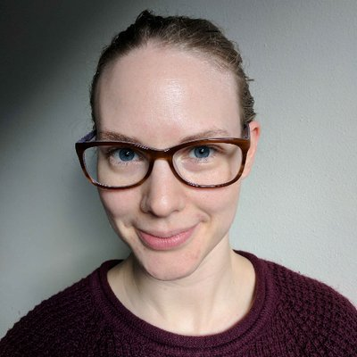

# What does industry need?

- **Panel 2**
- **Day 1: June 11th from 11:00 to 12:00 UTC-04:00 or ET**
- **How to connect:** [Zoom via Underline](https://underline.io/events/122/sessions?eventSessionId=4302)
- [**Questions Google document**](https://docs.google.com/document/d/1ZS8BhrAJHGa-RB5e8IHqSGsR6GAEpEXv552u9kZG1g0/edit#heading=h.lyabqqmampv5)

Many, if not most, of the students in our NLP courses go on to industry in a variety of roles. These roles range from software developers, to data scientists, to full-time researchers, each with their own skills and responsibilities. What does industry need from us as educators to produce students that meet their needs? This panel brings together folks from a variety of industries to hear about their experiences with NLP technology and students. Panelists will be asked to share their thoughts on what types of skills they want to see, how NLP is used in different roles in their organizations, and what role do state-of-the-art methods and research play in their production environments. We also encourage questions from the audience.

## Panelists
|               |                               |
| :---------------- | :------------------------------   | 
|  | [**Lenny Bronner**](https://lennybronner.com/) is a senior data scientist at The Washington Post.. | 
|  | [**Delip Rao**](http://deliprao.com/) is the Entrepreneur in Residence at the Allen Institute for AI.|
|  | [**Frank Rudzicz**](http://www.cs.toronto.edu/~frank/) is an Associate Professor in Computer Science at the University of Toronto, faculty member of Vector Institute for Artificial Intelligence and co-founder of [WinterLight Labs](https://winterlightlabs.com/). | 
|  | [**Rachael Tatman**](http://www.rctatman.com/) is a senior developer advocate for Rasa, working on open-source and conversational AI.|

